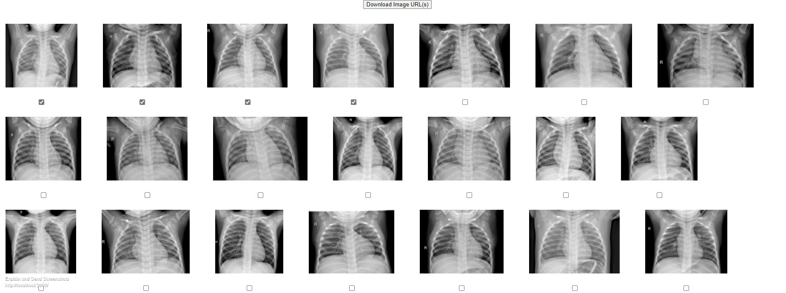

## Start the Docker

```bash

docker exec -it s3_read_php service apache2 start
[ ok ] Starting Apache httpd web server: apache2.

```

## URLs

http://localhost:8080/

http://localhost:8080/list-s3

```php

// included in 'includes/routes.php'

```


